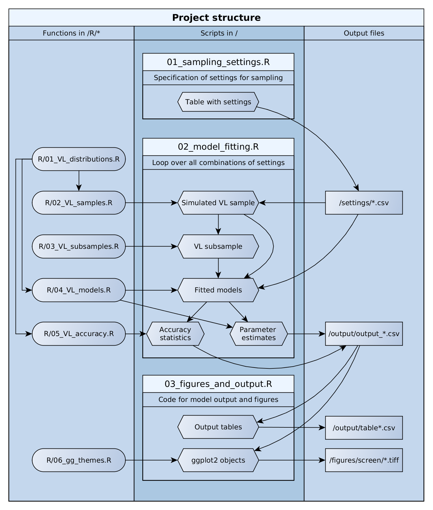

Simulation of vessel length distributions: Code from Link et al., 2018
================

Description
-----------

This repository contains the code for the simulations from Link et al., 2018, *Maximum likelihood estimation of xylem vessel length distributions*. Link: https://doi.org/10.1016/j.jtbi.2018.07.036

The scripts contained in this repository were used to generate and analyze the Monte Carlo samples of vessel length distributions discussed in said paper, and we refer to the full text for full documentation.

Contents and structure
----------------------

The repository is structured as follows:

``` text
/         basic scripts:
          01_sampling_settings.R  -- creates and exports the table that stores the settings
                                     used for the random samples
          02_model_fitting.R      -- performs random sampling, model fitting and evaluation
          03_figures_and_output.R -- creates the figures and tables for the publication
/figures  -- figures with model results
/output   -- model output and tables used in the paper
/R        -- 01_VL_distributions.R            -- utility functions for vessel length analyses
                                                 (identical to S3: VLscripts.R, renamed for clarity)
             02_VL_samples.R                  -- functions for the generation of random samples of
                                                 vessel lengths
             03_VL_subsamples.R               -- functions for the generation of subsamples of 
                                                 vessel lengths based on the output of the scripts 
                                                 in "R/02_VL_samples.R"
             04_VL_models.R                   -- code that automates model fitting on vessel length 
                                                 data based on the desired settings
             05_VL_accuracy.R                 -- utility functions for the analysis of the accuracy
                                                 of vessel length predictions
             gg_publication_themes_20180305.R -- settings for graphics
/settings -- table with the settings defined in "01_sampling_settings.R"      
```

The following figure shows a flowchart of the work flow of the project:


